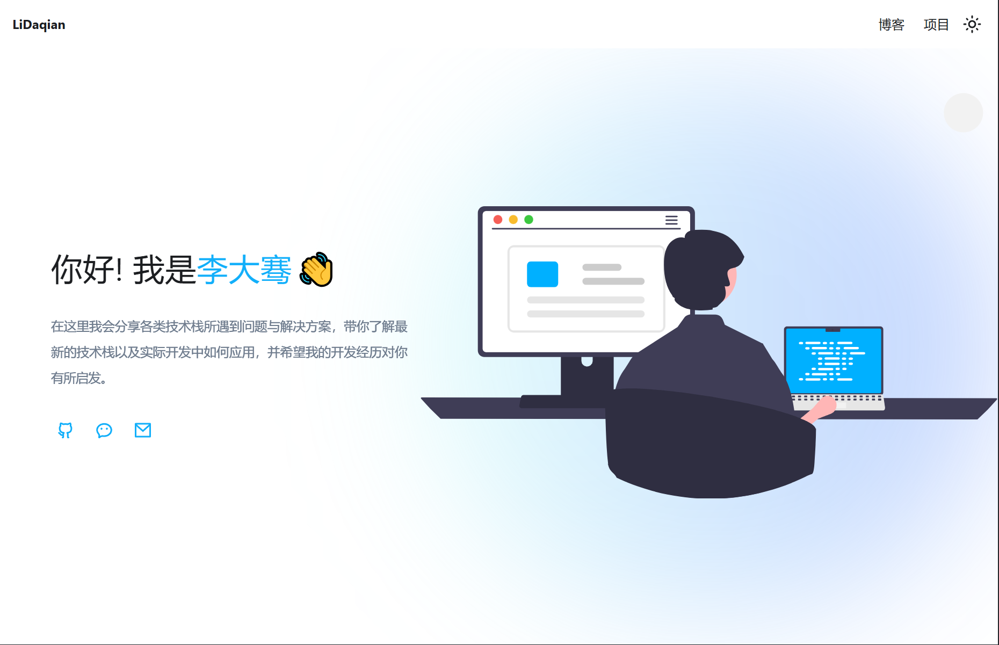

<h2 align="center">
李大骞的个人博客
</h2>
<p align="center">

<a href="https://vercel.com/new/clone?repository-url=https://github.com/li-daqian/blog/tree/main&project-name=blog&repo-name=blog" rel="nofollow"></a>
<a href="https://stackblitz.com/github/li-daqian/blog" rel="nofollow"></a>
</p>

## 👋 介绍

在这里我会分享各类技术栈所遇到问题与解决方案，带你了解最新的技术栈以及实际开发中如何应用，并希望我的开发经历对你有所启发。

如果你想要搭建一个类似的站点，可直接 [Fork](https://github.com/li-daqian/blog/fork) 本仓库使用，或者通过 [StackBlitz](https://stackblitz.com/github/li-daqian/blog) 在线运行本项目，通过 [Vercel](https://vercel.com/new/clone?repository-url=https://github.com/li-daqian/blog/tree/main&project-name=blog&repo-name=blog) 一键部署。

## ✨ 特性

- 🦖 **Docusaurus** - 基于 Docusaurus，提供强大的文档生成和博客功能
- ✍️ **Markdown** - 写作方便，Markdown
- 🎨 **Beautiful** - 整洁，美观，阅读体验优先
- 💯 **SEO** - 搜索引擎优化，易于收录
- 🔎 **全文搜索** - 支持 [Algolia DocSearch](https://github.com/algolia/docsearch)
- 🚀 **持续集成** - 支持 CI/CD，自动部署更新内容

## 📥 运行

```bash
git clone https://github.com/kuizuo/blog.git
cd blog
pnpm install
pnpm start
```

构建

```bash
pnpm build
```

## 📷 截图


## 📝 许可证

[MIT](./LICENSE)